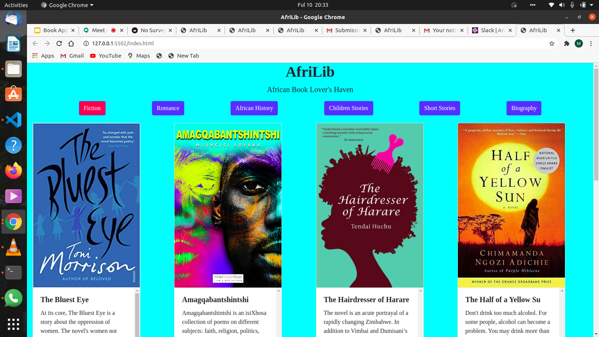

## AFRILIB
#### Book Application, &copy2020 Afrilib)
#### By **Millicent, Beatrice, Ann, Marcellus and Dennis**
## Description
An book app basically by African or African based writers/Authors.With different categories namely:
Romance, Fiction, Short-stories, African History, Children books and Biography. 
## Known Bugs
No known bugs.
## Technologies Used
html

css

bootstrap 

js/jquery  

google fonts

## Support and contact details

*Contributors:

*{Millicent Odhiambo - content sourcing and README.md, License

*Beatrice Wambui - Html

*Anne Wangari-JavaScript

*Marcellus Githua -information and slides 

*Dennis Kiambi-Figma and Mailchimp

# Project screenshot

# Project Figma Link
https://www.figma.com/file/k8vL3IyqkSKdQLilbg069q/Untitled?node-id=0%3A1
### License
[MIT] (https://github.com/BeatriceWambuiMbugua/AfriLib/blob/milly-pages/License) 

copyright (c) 2020.
